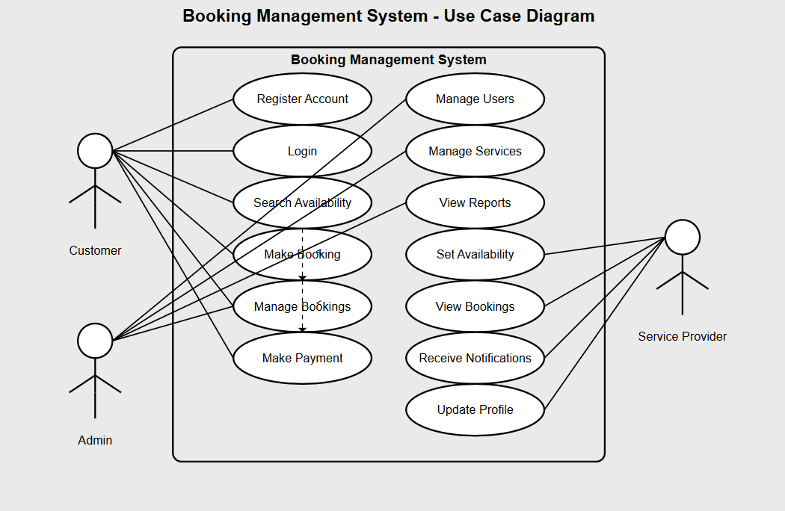

---

## 🎯 Use Case Diagrams

### What Are Use Case Diagrams?

**Use Case Diagrams** are a type of behavioral diagram defined by UML (Unified Modeling Language) that visually represent the functional requirements of a system. They illustrate how users (actors) interact with the system to achieve specific goals (use cases). These diagrams provide a high-level overview of system functionalities and user interactions.

### Benefits of Use Case Diagrams

- **Clarity:** They help stakeholders understand system functionality from a user perspective.
- **Communication:** They serve as an effective communication tool between technical and non-technical team members.
- **Scope Management:** They help define system boundaries and identify all possible interactions.
- **Requirement Validation:** They assist in validating that all user expectations are captured in the system.

### 📌 Use Case Diagram for the Booking Management System

Below is the use case diagram for the ALX Booking Management System. It highlights the major actors and the key actions they can perform in the system.

### Actors:
- **User (Guest):** Interacts with the system to search, book, and manage reservations.
- **Admin:** Manages room availability, user data, and oversees system functions.
- **Payment Gateway:** Handles transaction processing and confirmations.

### Key Use Cases:
- Search Available Rooms  
- Make Booking  
- Modify/Cancel Booking  
- View Booking History  
- Process Payment  
- Manage Room Inventory (Admin)  
- View Reports and Analytics (Admin)  
